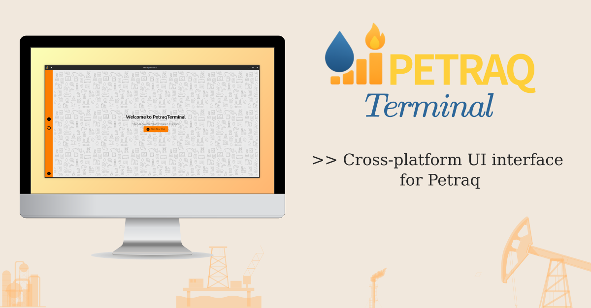
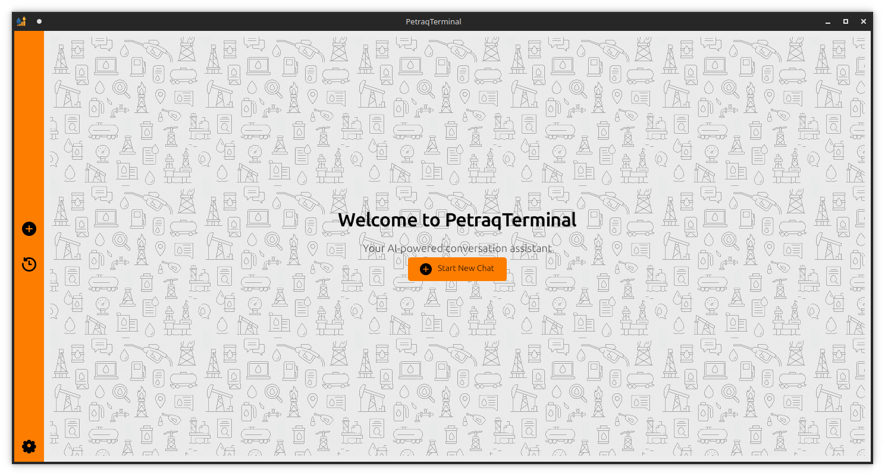
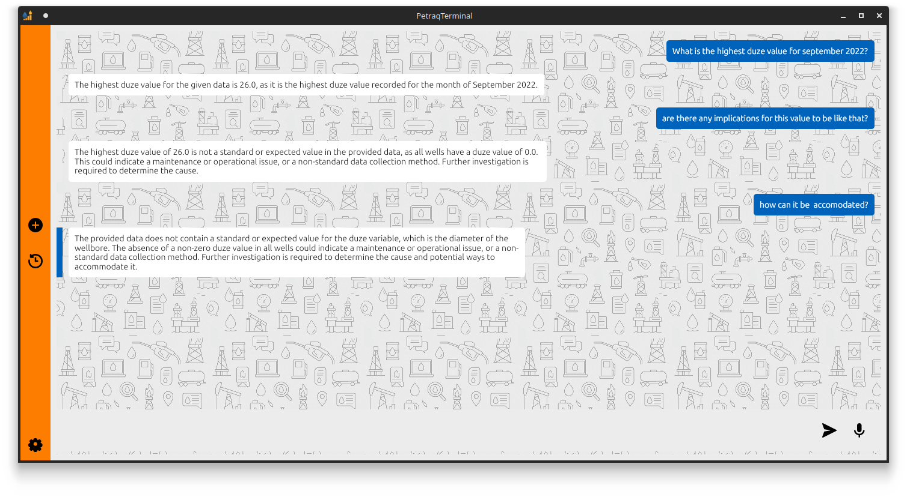
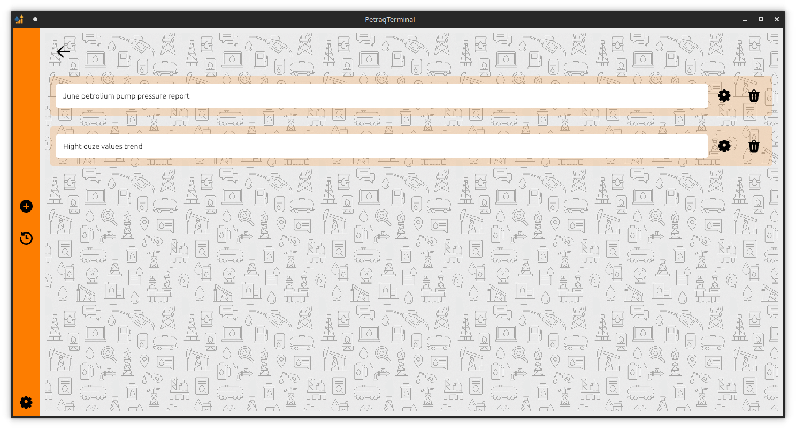
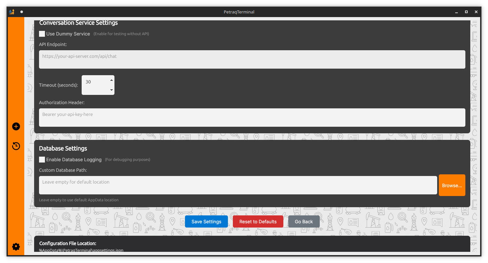

# PETRAQ Terminal

A cross-platform Avalonia UI terminal application built with .NET 9. This modular enterprise-grade desktop tool provides a lightweight interface for conversing with a local web API LLM model over oil and gas pumps production data.

> ⚠️ **Note:** The API backend must be hosted manually. See [Petraq API GitHub Repository](https://github.com/partzel/petraq) for setup instructions.



---

## Features

- ✳️ **LLM Chatbot Interface**: Terminal-style UI for interacting with a large language model on oil & gas production data.
- 🧩 **Modular & Configurable**: Easily extendable architecture following enterprise desktop application practices.
- 💻 **Cross-Platform**: Works on Windows, Linux, and macOS via Avalonia UI.
- 🧪 **.NET 9**: Built with the latest performance and language features.

---

## Screenshots






---

## Getting Started

### Prerequisites

- [.NET 9 SDK](https://dotnet.microsoft.com/en-us/download)
- The backend API hosted and running locally: [Petraq API GitHub Repository](https://github.com/partzel/petraq)

### Setup

1. **Clone the repository:**

   ```bash
   git clone https://github.com/PetraqForge/PetraqTerminal
   cd PetraqTerminal/PetraqTerminal
   ```

2. **Restore dependencies:**

   ```bash
   dotnet restore
   ```

3. **Run the app:**

   ```bash
   dotnet run
   ```

4. **Configure your API endpoint:**

   Update the endpoint URL in the `appsettings.json` or in-app config UI to point to your locally hosted API.

---

## Extending Functionality

The codebase is built to allow adding:

* New UI modules or views
* Alternate LLM endpoints
* Localization and theming
* More complex dialogue memory and analytics tools

---

## License

MIT License. See [`LICENSE`](https://github.com/PetraqForge/PetraqTerminal?tab=MIT-1-ov-file#readme) for details.

---

## Contributions

Contributions, feature ideas, and bug reports are welcome!

---

## 🔗 Related Projects

* [Check the LLM API GitHub Repository](https://github.com/partzel/petraq).

